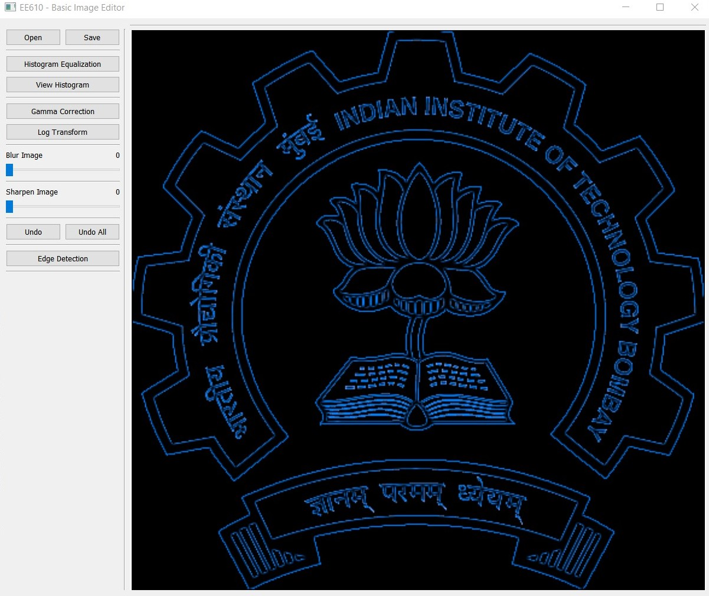

<!-- PROJECT SHIELDS -->
<!--
concise syntax you may use.
*** https://www.markdownguide.org/basic-syntax/#reference-style-links
-->
# EE610-image-editor
## Table of Contents
<!-- TABLE OF CONTENTS -->
<details open="open">
  <ol>
    <li>
      <a href="#about-the-project">About The Project</a>
      <ul>
        <li><a href="#introduction">Introduction</a></li>
        <li><a href="#built-with">Built With</a></li>
      </ul>
    </li>
    <li>
      <a href="#getting-started">Getting Started</a>
      <ul>
        <li><a href="#installation">Installation</a></li>
      </ul>
    </li>
    <li>
        <a href="#usage">Usage</a>
        <ul>
<li><a href="#running-the-gui">Running the GUI:</a>
</li>
<li><a href="#how-to-contribute?">How to contribute?</a>
</li>
        </ul>
    </li>
    <li><a href="#contributors">Contributors</a></li>
  </ol>
</details>


<!-- ABOUT THE PROJECT -->
## About The Project



### Introduction
The **Basic Image Editor application** is a simple and easy to use 
python based application which provide following basic image processing operations to apply and play with:
- Histogram equalization
- Gamma correction
- Log transform 
- Image blurring
- Image sharpening
- Edge detection
 
### Built With
* [Python](https://www.python.org/)
* [OpenCV](https://opencv.org/)
* [PyQt5](https://pypi.org/project/PyQt5/)

<!-- GETTING STARTED -->
## Getting Started
### Installation

1. Clone the repo
   ```sh
   git clone https://github.com/harshpaal/EE610-image-editor.git
   ```
   
2. Change the directory to **EE610-image-editor**
   ```sh
   cd EE610-image-editor
   ```

3. Install requirements
   ```sh
   pip install -r requirements.txt
   ```
   
### Running the GUI:
1. Run the main.py file
   ```sh
   python main.py
   ```

### How to contribute?
1. Fork the Project
2. Create your Feature Branch
   ```sh
   git checkout -b feature/ExampleFeature
   ```
3. Commit your Changes
   ```sh
   git commit -m 'Added ExampleFeature'
   ```
4. Push to the Branch
   ```sh
   git push origin feature/ExampleFeature
   ```
5. Open a Pull Request

<!-- CONTACT -->
## Contributors
* Harsh Pal - <a href="mailto:palharsh.india@gmail.com">palharsh.india@gmail.com</a>

